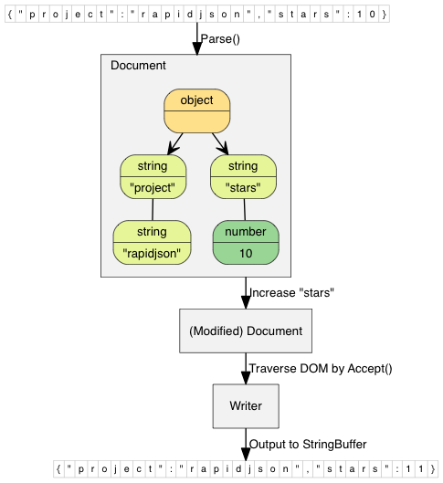

Tencent is pleased to support the open source community by making RapidJSON available.

Copyright (C) 2015 THL A29 Limited, a Tencent company, and Milo Yip. All rights reserved.

* [RapidJSON GitHub](https://github.com/miloyip/rapidjson/)
* RapidJSON 文档
  * [English](http://miloyip.github.io/rapidjson/)
  * [简体中文](http://miloyip.github.io/rapidjson/zh-cn/)
  * [GitBook](https://www.gitbook.com/book/miloyip/rapidjson/)可下载PDF/EPUB/MOBI，但不含API参考手册。

## Build 状态

| [Linux][lin-link] | [Windows][win-link] | [Coveralls][cov-link] |
| :---------------: | :-----------------: | :-------------------: |
| ![lin-badge]      | ![win-badge]        | ![cov-badge]          |

[lin-badge]: https://travis-ci.org/miloyip/rapidjson.png?branch=master "Travis build status"
[lin-link]:  https://travis-ci.org/miloyip/rapidjson "Travis build status"
[win-badge]: https://ci.appveyor.com/api/projects/status/u658dcuwxo14a8m9/branch/master "AppVeyor build status"
[win-link]:  https://ci.appveyor.com/project/miloyip/rapidjson/branch/master "AppVeyor build status"
[cov-badge]: https://coveralls.io/repos/miloyip/rapidjson/badge.png?branch=master
[cov-link]:  https://coveralls.io/r/miloyip/rapidjson?branch=master

## 简介

RapidJSON是一个C++的JSON解析器及生成器。它的灵感来自[RapidXml](http://rapidxml.sourceforge.net/)。

* RapidJSON小而全。它同时支持SAX和DOM风格的API。SAX解析器只有约500行代码。

* RapidJSON快。它的性能可与`strlen()`相比。可支持SSE2/SSE4.2加速。

* RapidJSON独立。它不依赖于BOOST等外部库。它甚至不依赖于STL。

* RapidJSON对内存友好。在大部分32/64位机器上，每个JSON值只占16或20字节（除字符串外）。它预设使用一个快速的内存分配器，令分析器可以紧凑地分配内存。

* RapidJSON对Unicode友好。它支持UTF-8、UTF-16、UTF-32 (大端序／小端序)，并内部支持这些编码的检测、校验及转码。例如，RapidJSON可以在分析一个UTF-8文件至DOM时，把当中的JSON字符串转码至UTF-16。它也支持代理对（surrogate pair）及`"\u0000"`（空字符）。

在[这里](doc/features.md)可读取更多特点。

JSON（JavaScript Object Notation）是一个轻量的数据交换格式。RapidJSON应该完全遵从RFC7159/ECMA-404。 关于JSON的更多信息可参考：
* [Introducing JSON](http://json.org/)
* [RFC7159: The JavaScript Object Notation (JSON) Data Interchange Format](http://www.ietf.org/rfc/rfc7159.txt)
* [Standard ECMA-404: The JSON Data Interchange Format](http://www.ecma-international.org/publications/standards/Ecma-404.htm)

## 兼容性

RapidJSON是跨平台的。以下是一些曾测试的平台／编译器组合：
* Visual C++ 2008/2010/2013 在 Windows (32/64-bit)
* GNU C++ 3.8.x 在 Cygwin
* Clang 3.4 在 Mac OS X (32/64-bit) 及 iOS
* Clang 3.4 在 Android NDK

用户也可以在他们的平台上生成及执行单元测试。

## 安装

RapidJSON是只有头文件的C++库。只需把`include/rapidjson`目录复制至系统或项目的include目录中。

生成测试及例子的步骤：

1. 执行 `git submodule update --init` 去获取 thirdparty submodules (google test)。
2. 下载 [premake4](http://industriousone.com/premake/download)。
3. 复制 premake4 可执行文件至 `rapidjson/build` （或系统路径）。
4. 进入`rapidjson/build/`目录，在Windows下执行`premake.bat`，在Linux或其他平台下执行`premake.sh`。
5. 在Windows上，生成位于`rapidjson/build/vs2008/`或`/vs2010/`内的项目方案.
6. 在其他平台上，在`rapidjson/build/gmake/`目录执行GNU `make`（如 `make -f test.make config=release32`、`make -f example.make config=debug32`）。
7. 若成功，可执行文件会生成在`rapidjson/bin`目录。

生成[Doxygen](http://doxygen.org)文档的步骤：

1. 下载及安装[Doxygen](http://doxygen.org/download.html)。
2. 在顶层目录执行`doxygen build/Doxyfile`。
3. 在`doc/html`浏览文档。

## 用法一览

此简单例子解析一个JSON字符串至一个document (DOM)，对DOM作出简单修改，最终把DOM转换（stringify）至JSON字符串。

~~~~~~~~~~cpp
// rapidjson/example/simpledom/simpledom.cpp`
#include "rapidjson/document.h"
#include "rapidjson/writer.h"
#include "rapidjson/stringbuffer.h"
#include <iostream>

using namespace rapidjson;

int main() {
    // 1. 把JSON解析至DOM。
    const char* json = "{\"project\":\"rapidjson\",\"stars\":10}";
    Document d;
    d.Parse(json);

    // 2. 利用DOM作出修改。
    Value& s = d["stars"];
    s.SetInt(s.GetInt() + 1);

    // 3. 把DOM转换（stringify）成JSON。
    StringBuffer buffer;
    Writer<StringBuffer> writer(buffer);
    d.Accept(writer);

    // Output {"project":"rapidjson","stars":11}
    std::cout << buffer.GetString() << std::endl;
    return 0;
}
~~~~~~~~~~

注意此例子并没有处理潜在错误。

下图展示执行过程。

还有许多[例子](https://github.com/miloyip/rapidjson/tree/master/example)可供参考。
